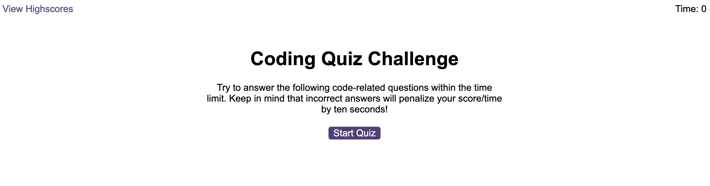
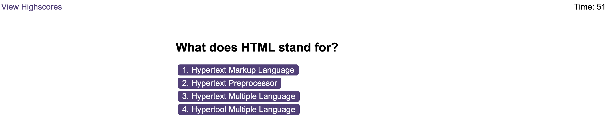
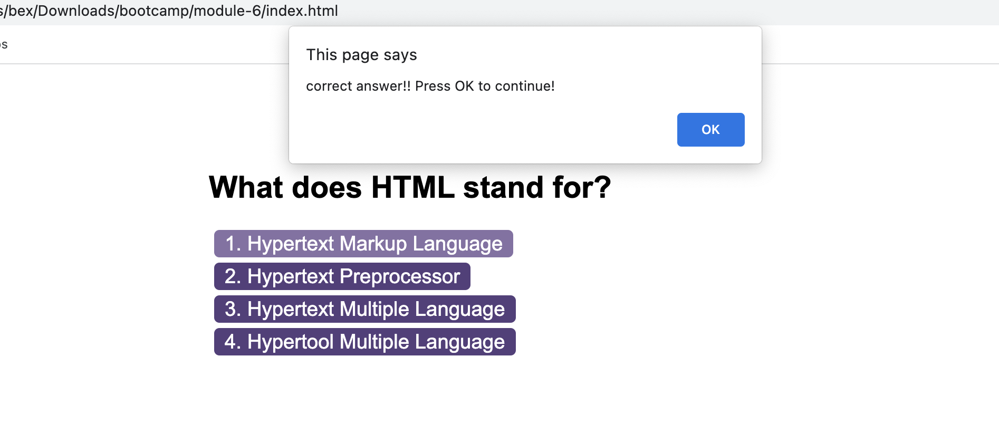
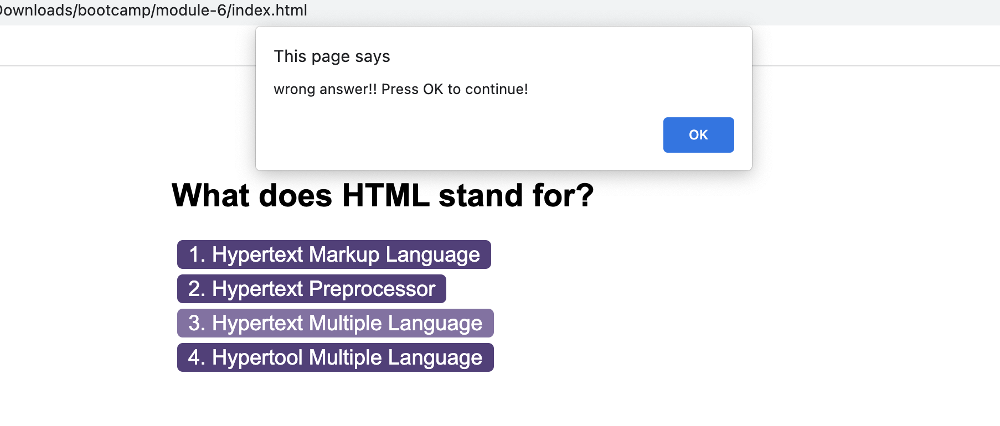
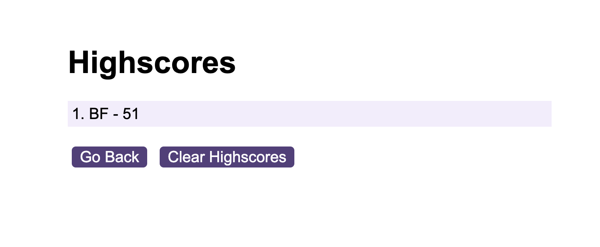
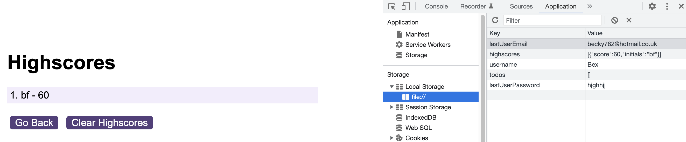

# Module 6 Challenge Web APIs: Code Quiz

## Your Task

As you proceed in your journey to becoming a front-end web developer, it’s likely that you’ll be asked to complete a coding assessment, perhaps as part of an interview process. A typical coding assessment is a combination of multiple-choice questions and interactive coding challenges. 

To help you become familiar with these tests and give you a chance to apply the skills from this module, this week’s challenge invites you to build a timed coding quiz with multiple-choice questions. This app will run in the browser, and will feature dynamically updated HTML and CSS powered by JavaScript code that you write. It will have a clean, polished, and responsive user interface. This week’s coursework has taught you all the skills you need to succeed in this challenge.
 

## User Story

```
AS A coding boot camp student
I WANT to take a timed quiz on JavaScript fundamentals that stores high scores
SO THAT I can gauge my progress compared to my peers
```

## Acceptance Criteria

Create a code quiz that contains the following requirements:

* A start button that when clicked a timer starts and the first question appears.
 
  * Questions contain buttons for each answer.
  * When answer is clicked, the next question appears
  * If the answer clicked was incorrect then subtract time from the clock

* The quiz should end when all questions are answered or the timer reaches 0.

  * When the game ends, it should display their score and give the user the ability to save their initials and their score
  
## What i learned from this project:
Initially this project it included **two** HTML files: index.html and highscores.html. I had to create **three** JavaScript files: questions.js, logic.js and scores.js. This project was very challenging, implementing the JavaScript skills that we have learned so far into this bootcamp. 

Below is a screenshot of the Home Page. As you can see the Time at the top right side of the page is 0. When starting the quiz the user will have 75 seconds to complete the 5 questions that i have created.



Below is a screenshot of the questions that are presented once the user clicks **Start Quiz**:



When the user clicks **Start Quiz** age they are presented with the questions the time then starts decreasing. If the user correctly answers the question it will have a prompt indicating they are correct however if there answer incorrectly it will say so. (see below screenshots)





Once the questions are complete the user will be asked to submit there initials which will be saved:



**Local Storage:**
When you inspect the page it shows that the results have saved into the local storage: 



## GitHub
https://github.com/bex-ford/module-6

## Licence 
NONE
